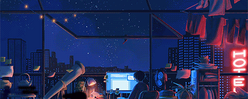

 
  

# Hi there, I'm Mani
Software Engineer  |  Open-source Enthusiast 
## About me
I'm an undergraduate Computer Science student and a full-stack engineer who loves building 

I break things, learn fast, and make shit happen deep into code and cs anything that pushes the limits.

- Currently deep into **Full-stack Developmen**t 
- Learning **DevOps** 
- Learning **Machine learning, AI models, exploring Agentic AI** 
- Exploring **Blockchain Network and Functioning, Cryptocurrency** 

## Experience
- **Google** - **As a Prompt Engineer** - Helped in building their AI models of image generation, helped in generating prompts for different varieties and regions in the span of 4 months, and led a team of 8 team members. You can find out about this experience in my resume.
  
- **Gssoc ext 24** - **As a Developer** - Contributed in several projects threw my experience in Full-stack development and in Machine learning, merged over 100+ PRs in the span of 2 months, contributed to different projects building AI models and UI development.

## Projects
- [Peeklink](https://github.com/devxMani/Peek-link) - Peeklink is a simple web tool that lets you preview how your website or project link will look across multiple social media platforms.(https://peek-link.vercel.app/)
- [StoryForge AI](https://github.com/devxMani/StoryForge-AI) - Developed a full-stack platform for creating interactive, AI-generated adventure stories, enabling users to create and explore interactive stories.
- [Apple iPhone 15 site](https://github.com/devxMani/Apple-iPhone-15-site) - This is a clone website of the iPhone 15 Pro, featuring 3D models and dynamic animations that bring the device to life. The smooth interactions and immersive visuals replicate the experience of a real product site.(https://apple-i-phone-15-site.vercel.app/)
- [Codify](https://github.com/devxMani/Codify) - Codify transforms your source code into stunning, shareable images with customizable themes, fonts, and backgrounds—perfect for developers and tutorials. (https://codify-code.vercel.app/)
- [ASCII motion](https://github.com/devxMani/ASCII-Motion) - An Add-On for the Terminal that generates video that converts video files into colored ASCII art and plays them in real-time.
- [2025 calendar](https://github.com/devxMani/2025-Calender) - 2025 Calendar is a web application designed to create and manage calendar events for the year 2025.

 
 

If you like my projects, Give them ⭐ and Share them!

