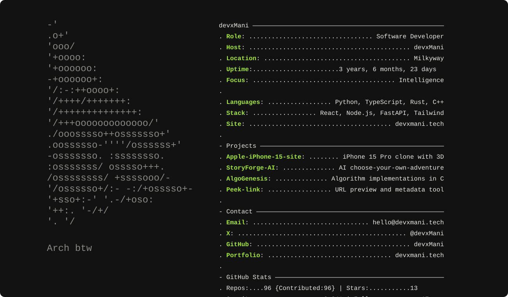

<!-- <p align= "center">

</p>


# _Hi there I'm Mani_  < Imagine Infinity.
```lua
-- ~/whoami

local mani = {
  solving = "Intelligence",
  location = "milkyway",
  languages = { "python", "ts", "rust", "c++" },
  site = "https://devxmani.tech",
  x = "https://x.com/devxMani",
}
``` -->
<!-- <picture>
  <!-- <source media="(prefers-color-scheme: dark)" srcset="dark_mode.svg">
  <source media="(prefers-color-scheme: light)" srcset="light_mode.svg"> --> -->
  
  <p align="center">
  
</p>
  

  
  
<!-- </picture> -->
